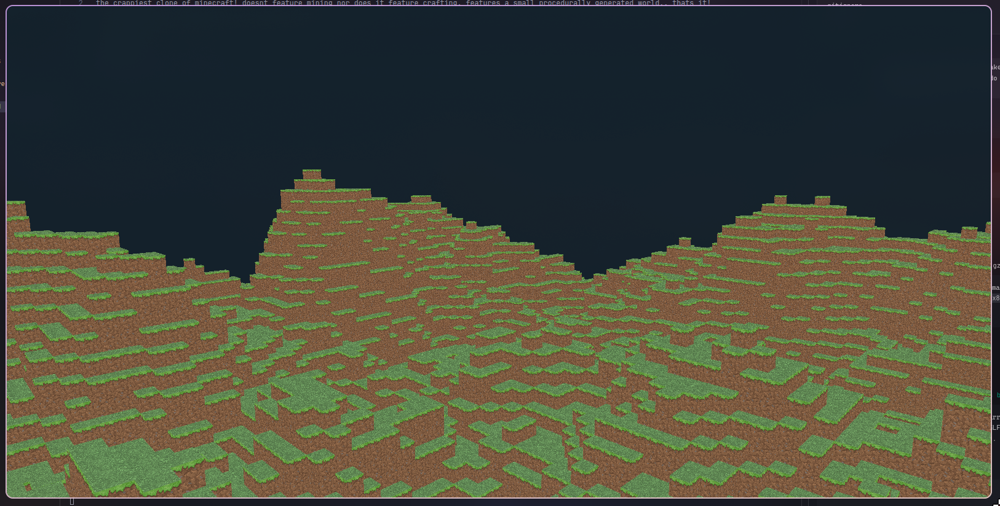
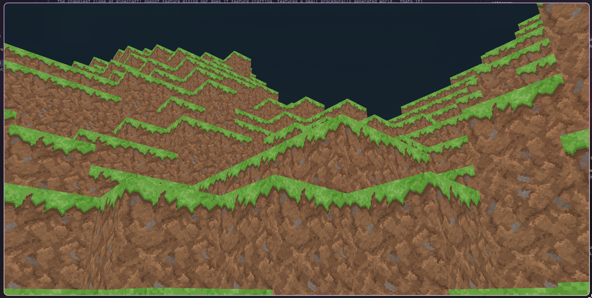

# Minecrap

The crappiest clone of Minecraft!

Minecrap is a small Minecraft clone made in C++ and OpenGL. It features a small procedurally generated world, textured blocks, and basic first-person movement (flight)..

Does it feature mining? No..
Does it feature crafting? Nope..
Does it feature a small procedurally generated world? Yep!

That's pretty much it!! very fun!

## Building

Make sure you have `g++` and `make` installed.

```bash
git clone https://github.com/FaizeenHoque/minecraft
cd minecraft
make run
```

You can also check the Releases section for pre-built versions.

## Screenshots




